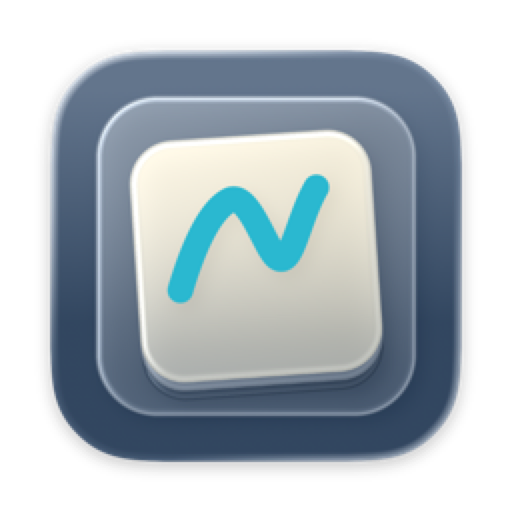
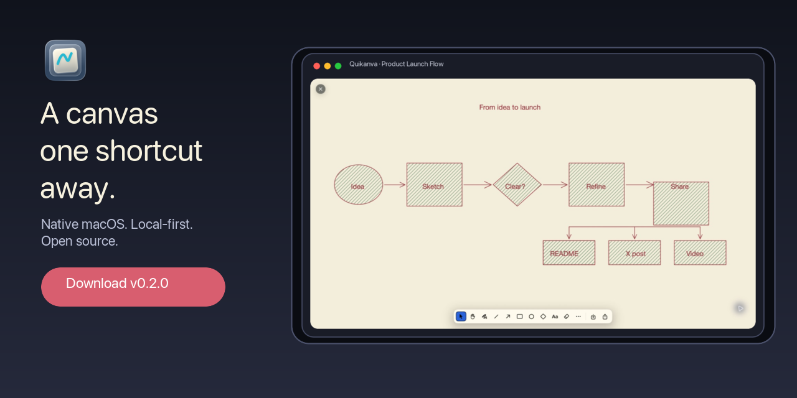
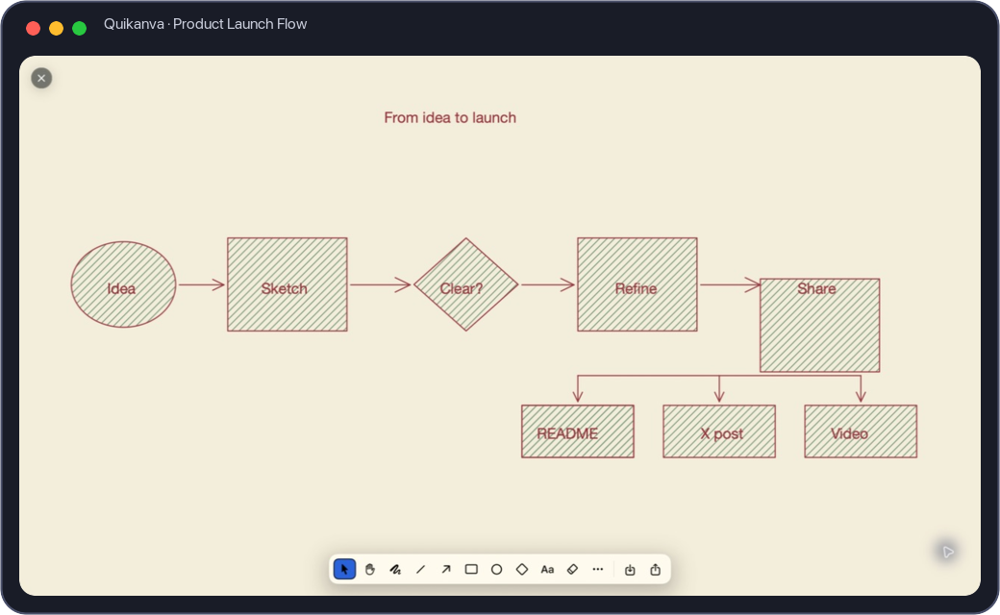
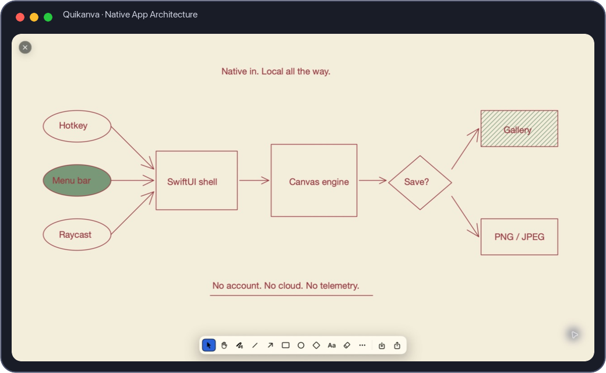

<p align="center">
  
</p>

<h1 align="center">Quikanva</h1>

<p align="center"><strong>A native macOS sketch canvas that is one shortcut away.</strong></p>

<p align="center">
  <a href="https://github.com/mikr13/quikanva/releases/latest"></a>
  <a href="https://github.com/mikr13/quikanva/actions/workflows/ci.yml"></a>
  
  
  <a href="LICENSE"></a>
</p>



Quikanva is a free, open-source visual scratchpad for Mac. Press <kbd>⌘</kbd><kbd>⇧</kbd><kbd>K</kbd>, sketch an idea with shapes, arrows, text, images, or freehand ink, then copy or export it. There is no account, cloud workspace, or document setup to get between the thought and the canvas.

## Why Quikanva?

- **Instant:** open a new canvas from a global shortcut, the menu bar, Raycast, or a `quikanva://` URL.
- **Capable:** draw, select, resize, rotate, curve, style, layer, align, and export real diagrams.
- **Native:** built with SwiftUI and AppKit, with Mac menus, shortcuts, windows, accessibility, dark mode, and reduced-motion support.
- **Local-first:** sketches autosave on your Mac. Quikanva has no account, analytics, ads, or network service.
- **Focused:** floating canvases and a visual gallery, without the machinery of a collaborative whiteboard.

## See it in action

| A real launch workflow | A native, local architecture map |
|---|---|
|  |  |

Both examples were drawn and captured in Quikanva. They use its shipping canvas tools rather than mock UI.

## Install

Quikanva requires macOS 14 Sonoma or later.

1. Open the [latest GitHub release](https://github.com/mikr13/quikanva/releases/latest).
2. Download `Quikanva-<version>-unsigned.zip` and unzip it.
3. Move `Quikanva.app` to `/Applications`.
4. On first launch, Control-click Quikanva in Finder, choose **Open**, then confirm **Open**.

> [!IMPORTANT]
> Current direct-download builds are unsigned. macOS will show an unidentified-developer warning on first launch. Only download Quikanva from this repository. Developer ID signing and notarization are planned so future downloads can pass Gatekeeper normally.

Prefer to inspect and build the source yourself? See [Development](docs/DEVELOPMENT.md).

## Your first sketch

1. Launch Quikanva. It lives in the menu bar and does not add a Dock icon.
2. Press <kbd>⌘</kbd><kbd>⇧</kbd><kbd>K</kbd> anywhere to open a canvas.
3. Draw immediately with the default freehand tool, or press a tool key such as <kbd>R</kbd>, <kbd>A</kbd>, or <kbd>T</kbd>.
4. Use the share button to copy the sketch or export PNG/JPEG.
5. Open the Gallery from the menu bar or press <kbd>⌘</kbd><kbd>G</kbd> while Quikanva is active.

Sketches autosave locally as you work. Read the [User Guide](docs/USER_GUIDE.md) for selection, styling, gallery management, always-on-top canvases, automation, and export.

## Tools

| Tool | Default key | Typical use |
|---|:---:|---|
| Select | <kbd>V</kbd> | Select, marquee, move, resize, rotate, and edit elements |
| Hand | <kbd>H</kbd> | Pan the canvas |
| Freehand | <kbd>P</kbd> | Notes, annotations, and loose sketches |
| Rectangle | <kbd>R</kbd> | Steps, components, cards, and containers |
| Ellipse | <kbd>O</kbd> | Start/end nodes and concepts |
| Diamond | <kbd>D</kbd> | Decisions and branches |
| Line | <kbd>L</kbd> | Dividers and relationships |
| Arrow | <kbd>A</kbd> | Directional flows and dependencies |
| Text | <kbd>T</kbd> | Labels and notes |
| Eraser | <kbd>E</kbd> | Remove elements by clicking or dragging |

Tool shortcuts can be reassigned in **Settings → Canvas**. See the complete [Shortcut Reference](docs/SHORTCUTS.md).

## Highlights

- Hand-drawn and precise vector styles
- Solid, hachure, dashed, and dotted treatments
- Open, closed, and filled arrowheads
- Curved lines and arrows with editable points
- Multi-select, duplicate, z-order, snapping, and alignment guides
- Image paste and drag-and-drop
- Portrait, square, standard, and widescreen canvases
- Configurable defaults for canvas, drawing, text, and shortcuts
- Optional always-on-top canvases and launch at login
- PNG/JPEG export with optional background, plus copy to clipboard
- Sticky-note-style gallery with rename, selection, batch delete, and export
- `quikanva://` routes and included Raycast commands

## Privacy

Quikanva does not create an account, send analytics, or upload sketches. App data is stored under `~/Library/Application Support/Quikanva/`. Read the short [Privacy Note](docs/PRIVACY.md) for the exact boundary.

## Automation

Quikanva registers these URL routes:

```text
quikanva://new
quikanva://gallery
quikanva://open?id=<UUID>
```

Raycast script commands are included in [`integrations/raycast`](integrations/raycast/README.md).

## Documentation

- [User Guide](docs/USER_GUIDE.md)
- [Shortcut Reference](docs/SHORTCUTS.md)
- [Troubleshooting](docs/TROUBLESHOOTING.md)
- [Privacy Note](docs/PRIVACY.md)
- [Development Guide](docs/DEVELOPMENT.md)
- [Release Process](RELEASING.md)
- [Changelog](CHANGELOG.md)
- [Roadmap](PLAN.md)

## Contributing

Bug reports, focused feature proposals, documentation improvements, and pull requests are welcome. Start with [CONTRIBUTING.md](CONTRIBUTING.md), follow the [Code of Conduct](CODE_OF_CONDUCT.md), and report vulnerabilities through the private process in [SECURITY.md](SECURITY.md).

The current roadmap deliberately keeps real-time collaboration, cloud sync, Windows/Linux support, and a full illustration workflow out of scope. Focused contributions that strengthen the native quick-canvas experience are the best fit.

## Built with

- Swift 6, SwiftUI, AppKit, Core Graphics, and SwiftData
- [KeyboardShortcuts](https://github.com/sindresorhus/KeyboardShortcuts) by Sindre Sorhus
- XcodeGen for reproducible project generation

## License

Quikanva is available under the [MIT License](LICENSE). Copyright © 2026 Mihir Kumar.
