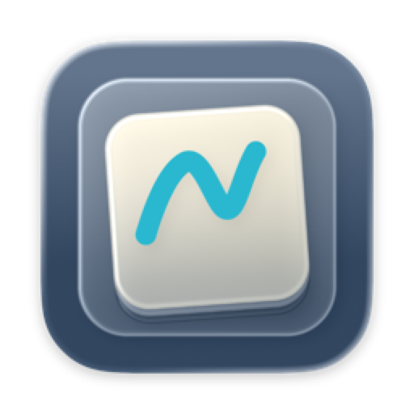
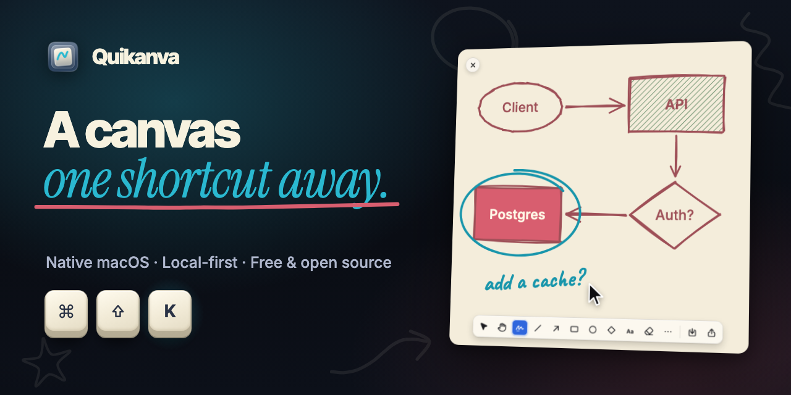
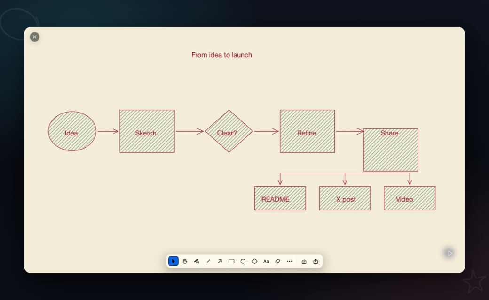
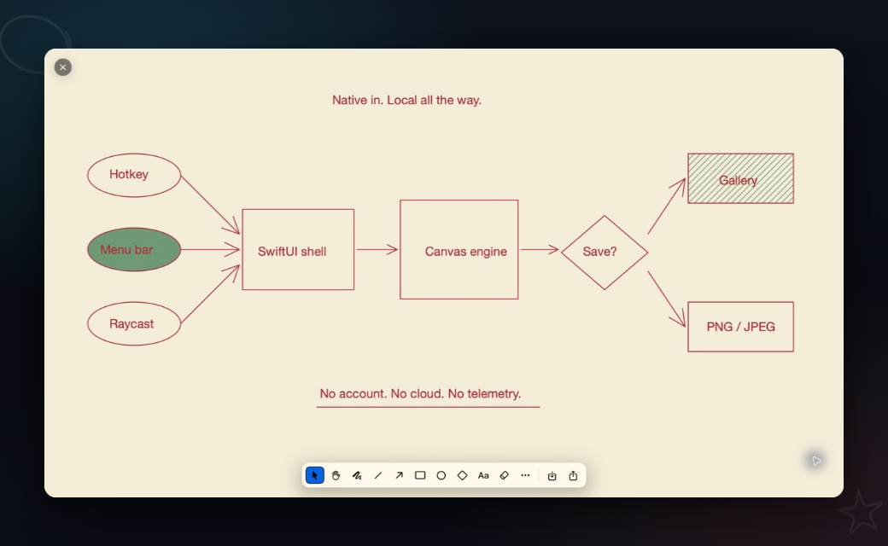

<p align="center">
  
</p>

<h1 align="center">Quikanva</h1>

<p align="center"><strong>A native macOS sketch canvas that is one shortcut away.</strong></p>

<p align="center">
  <a href="https://github.com/mikr13/quikanva/releases/latest"></a>
  <a href="https://github.com/mikr13/quikanva/actions/workflows/ci.yml"></a>
  
  
  <a href="LICENSE"></a>
</p>

[](https://github.com/mikr13/quikanva/releases)

Quikanva is a free, open-source visual scratchpad for Mac. Press <kbd>⌘</kbd><kbd>⇧</kbd><kbd>K</kbd>, sketch an idea with shapes, arrows, text, images, or freehand ink, then copy or export it. There is no account, cloud workspace, or document setup to get between the thought and the canvas.

## Why Quikanva?

- **Instant:** open a new canvas from a global shortcut, the menu bar, Raycast, or a `quikanva://` URL.
- **Capable:** draw, select, resize, rotate, curve, style, layer, align, and export real diagrams.
- **Native:** built with SwiftUI and AppKit, with Mac menus, shortcuts, windows, accessibility, dark mode, and reduced-motion support.
- **Local-first:** sketches autosave on your Mac. Quikanva has no account, analytics, ads, or network service.
- **Focused:** floating canvases and a visual gallery, without the machinery of a collaborative whiteboard.

## See it in action

| A real launch workflow | A native, local architecture map |
|---|---|
|  |  |

Both examples were drawn and captured in Quikanva. They use its shipping canvas tools rather than mock UI.

## Install

Quikanva requires macOS 14 Sonoma or later.

1. Open the [latest GitHub release](https://github.com/mikr13/quikanva/releases/latest).
2. Download `Quikanva-<version>-unsigned.zip` and unzip it.
3. Move `Quikanva.app` to `/Applications`.
4. On first launch, Control-click Quikanva in Finder, choose **Open**, then confirm **Open**.

> [!IMPORTANT]
> Current direct-download builds are unsigned. macOS will show an unidentified-developer warning on first launch. Only download Quikanva from this repository. Developer ID signing and notarization are planned so future downloads can pass Gatekeeper normally.

Prefer to inspect and build the source yourself? See [Development](docs/DEVELOPMENT.md).

## Your first sketch

1. Launch Quikanva. It lives in the menu bar and does not add a Dock icon.
2. Press <kbd>⌘</kbd><kbd>⇧</kbd><kbd>K</kbd> anywhere to open a canvas.
3. Draw immediately with the default freehand tool, or press a tool key such as <kbd>R</kbd>, <kbd>A</kbd>, or <kbd>T</kbd>.
4. Use the share button to copy the sketch or export PNG/JPEG.
5. Open the Gallery from the menu bar or press <kbd>⌘</kbd><kbd>G</kbd> while Quikanva is active.

Sketches autosave locally as you work. Read the [User Guide](docs/USER_GUIDE.md) for selection, styling, gallery management, always-on-top canvases, automation, and export.

## Tools

| Tool | Default key | Typical use |
| --- | :---: | --- |
| Select | <kbd>V</kbd> | Select, marquee, move, resize, rotate, and edit elements |
| Hand | <kbd>H</kbd> | Pan the canvas |
| Freehand | <kbd>P</kbd> | Notes, annotations, and loose sketches |
| Rectangle | <kbd>R</kbd> | Steps, components, cards, and containers |
| Ellipse | <kbd>O</kbd> | Start/end nodes and concepts |
| Diamond | <kbd>D</kbd> | Decisions and branches |
| Line | <kbd>L</kbd> | Dividers and relationships |
| Arrow | <kbd>A</kbd> | Directional flows and dependencies |
| Text | <kbd>T</kbd> | Labels and notes |
| Eraser | <kbd>E</kbd> | Remove elements by clicking or dragging |

Tool shortcuts can be reassigned in **Settings → Canvas**. See the complete [Shortcut Reference](docs/SHORTCUTS.md).

## Features

### Capture instantly

- Global shortcut (<kbd>⌘</kbd><kbd>⇧</kbd><kbd>K</kbd> by default) that opens a new canvas from any app, with prewarmed windows that appear right away
- Menu-bar app with **New Canvas**, **Open Gallery**, **Settings**, and **Quit**, and no Dock icon
- `quikanva://` URL routes and included Raycast script commands
- Optional launch at login
- Always-on-top canvas windows for presenting and screen sharing, toggled from Settings, the Canvas menu, or a global shortcut (<kbd>⌃</kbd><kbd>⌥</kbd><kbd>T</kbd> by default)
- A limit on how many canvases can be open at once, or no limit at all

### Draw

- Shapes, lines, arrows, text, images, and freehand ink from a floating toolbar that adapts to the window width
- Freehand selected on every new canvas, with smoothing applied when you finish a stroke
- Inline text editing directly on the canvas
- Image paste and drag-and-drop, with an optional subtle shadow
- An eraser that removes elements with a click or a drag
- Scroll and Hand-tool panning, pinch zoom, and zoom in, out, to fit, to selection, or reset, with smooth, interruptible transitions

### Select and arrange

- Click, Shift-click, and marquee selection
- Move, rotate, and resize with eight handles, holding Shift to keep proportions
- Arrow-key nudging in 1-point steps, or 10-point steps with Shift
- Duplicate, copy and paste, delete, bring to front, and send to back
- Curved lines and arrows with draggable endpoints and midpoint, which keep their resize and rotate handles
- Snapping to other elements, the viewport, and the grid, with alignment guides and an Option-drag bypass
- Native undo and redo for every canvas change

### Style

- Hand-drawn or precise rendering with adjustable roughness, seeded per element so the sketchy look never shimmers as you pan, zoom, or redraw
- Stroke, fill, and canvas background colors
- Solid or hachure fills
- Solid, dashed, or dotted strokes with adjustable width and opacity
- Open, closed, filled, or bar arrowheads, on one end or both
- Text in Helvetica Neue, Avenir Next, Comic Sans MS, Georgia, or Menlo, with weight, size, alignment, and italic, underline, or strikethrough styling
- A style inspector that applies to the current selection or to new elements

### Save and organize

- Autosave shortly after each change, which skips unchanged canvases and flushes when a window closes
- Memorable two-word titles with the creation date and time, such as `Cosmic Ladle - 2026-08-05 14:30`
- <kbd>⌘</kbd><kbd>S</kbd> to give a sketch a deliberate name
- Automatic cleanup of empty canvases on close, which you can turn off
- A sticky-note-style Gallery that shows each sketch at its real aspect ratio
- Gallery actions to open, rename, export, and delete, plus multi-select, select all, and batch delete

### Export and share

- Copy as image (<kbd>⌘</kbd><kbd>⇧</kbd><kbd>C</kbd>), PNG export (<kbd>⌘</kbd><kbd>E</kbd>), and JPEG export
- 2x rendering, cropped tightly to your content
- An optional background, so PNGs can be transparent
- Sharing from an open canvas or straight from a Gallery card

### Customize

- Portrait (9:16), Square (1:1), Standard (4:3), and Widescreen (16:9) canvas frames
- Defaults for background, stroke, and fill colors, drawing and fill style, stroke and arrowhead style, and text font, weight, and size
- A reassignable key for every drawing tool, where choosing a taken key swaps the two
- Recordable global shortcuts and a system or sortable date format for new titles

### Built for the Mac

- A SwiftUI shell around an AppKit canvas, with native menus, windows, and undo
- Liquid Glass on the toolbar and Gallery on macOS 26 and later, with accessible fallbacks on older versions
- Fluid, spring-based motion for tools, the style inspector, and Gallery cards that respects Reduced Motion
- VoiceOver labels, keyboard access, dark mode, and Increased Contrast support
- A layered app icon made with Icon Composer

## Privacy

Quikanva does not create an account, send analytics, or upload sketches. App data is stored under `~/Library/Application Support/Quikanva/`. Read the short [Privacy Note](docs/PRIVACY.md) for the exact boundary.

## Automation

Quikanva registers these URL routes:

```text
quikanva://new
quikanva://gallery
quikanva://open?id=<UUID>
```

Raycast script commands are included in [`integrations/raycast`](integrations/raycast/README.md).

## Documentation

- [User Guide](docs/USER_GUIDE.md)
- [Shortcut Reference](docs/SHORTCUTS.md)
- [Troubleshooting](docs/TROUBLESHOOTING.md)
- [Privacy Note](docs/PRIVACY.md)
- [Development Guide](docs/DEVELOPMENT.md)
- [Release Process](RELEASING.md)
- [Changelog](CHANGELOG.md)

## Roadmap

Everything under [Features](#features) is available today. Here is what comes next.

### Planned

- [ ] Developer ID signing and notarization, so downloads open without a Gatekeeper warning
- [ ] PDF and SVG export
- [ ] Import of Excalidraw files
- [ ] iCloud sync across your Macs
- [ ] Performance audit in Instruments: no dropped frames while drawing, panning, and zooming 500+ sketch-style elements
- [ ] Full manual QA pass: every tool, resize and rotate, multi-select, the undo chain, closing without saving, reopening, exports, hotkey, Raycast, and URL launch, dark mode, Reduced Motion, and VoiceOver

### Not planned

These are out of scope for now, to keep Quikanva fast and focused:

- Accounts or a hosted cloud service
- iOS, iPadOS, Windows, or Linux versions
- Mac App Store distribution
- Plugins and shape libraries
- A full illustration workflow

Have an idea that fits? [Open a feature request](https://github.com/mikr13/quikanva/issues/new?template=feature_request.yml).

## Contributing

Bug reports, focused feature proposals, documentation improvements, and pull requests are welcome. Start with [CONTRIBUTING.md](CONTRIBUTING.md), follow the [Code of Conduct](CODE_OF_CONDUCT.md), and report vulnerabilities through the private process in [SECURITY.md](SECURITY.md).

Check the [Roadmap](#roadmap) before proposing a feature. Focused contributions that strengthen the native quick-canvas experience are the best fit.

## Built with

- Swift 6, SwiftUI, AppKit, Core Graphics, and SwiftData
- A custom vector engine on an AppKit canvas view, used instead of PencilKit because PencilKit's editable canvas is limited to UIKit and Mac Catalyst apps
- Local sketch storage as scene JSON with PNG thumbnails in SwiftData
- [KeyboardShortcuts](https://github.com/sindresorhus/KeyboardShortcuts) by Sindre Sorhus
- XcodeGen for reproducible project generation

## License

Quikanva is available under the [MIT License](LICENSE). Copyright © 2026 Mihir Kumar.
